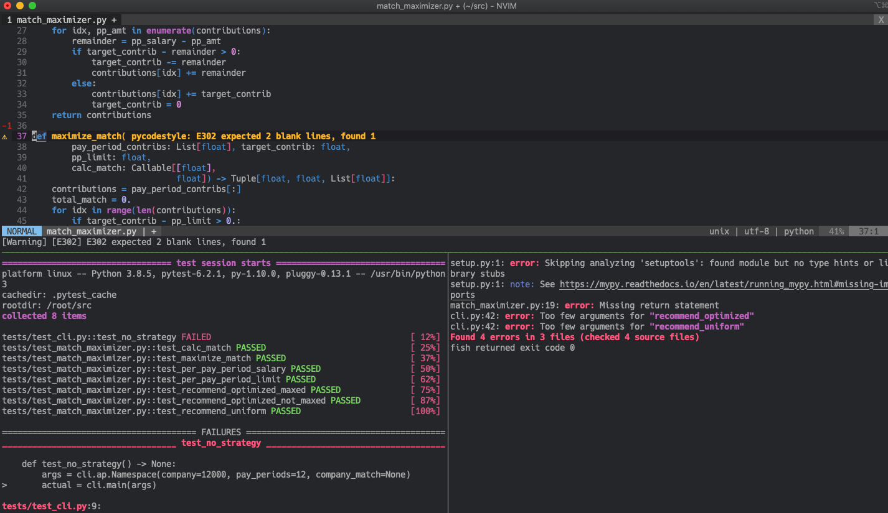

# Why

*   Portability: move seamlessly across operating systems and be productive immediately with minimal time wasted on setup and configuration
*   Dependency management: avoid breaking changes in the complex interdependencies across CLI tools by applying updates in a sandbox
*   Experimentation: be as destructive or radical as you like as you try out different tools or ways of working without the risk of breaking your existing setup
*   Isolation: achieve greater isolation-- in theory you could be working on the same codebase in two different IDE containers with different sets of project dependencies installed

***

# Installation

`$ git clone https://github.com/circld/cli_ide && cd cli_ide`

`$ docker build . -t cli_dev:latest`

# Usage

For an ephemeral development environment:

`$ docker run --name cli_ide --rm -it --mount type=bind,src=(pwd),dst=/src cli_dev:latest`

Or with this `fish` [utility function](https://github.com/circld/Prefs/blob/master/.config/fish/functions/utilities.fish):

`$ dev`

# TODO

## Near-term

*   centos7
    *   confirm that changes to lightline don't break build for Centos7 image
    *   add tealdeer to centos dockerfile
    *   add [fd](https://github.com/sharkdp/fd)
*   use [static binaries](https://github.com/dbrgn/tealdeer/releases) for `tealdeer`
*   experiment with including [fisher](https://github.com/jorgebucaran/fisher) and [fzf.fish](https://github.com/PatrickF1/fzf.fish)
*   do i want `node`/`npm` as dependencies (used for a variety of language servers)
*   add specific versions to installs for a more deterministic build

## Longer-term

*   expose a range of ports (but then... cannot be interactive? think this through)
    *   take port mappings as an optional argument
*   should the default user *really* be `root`?
    *   https://specifications.freedesktop.org/basedir-spec/basedir-spec-latest.html
    *   https://linoxide.com/linux-how-to/create-home-directory-existing-user-linux/
    *   https://medium.com/better-programming/docker-best-practices-and-anti-patterns-e7cbccba4f19
*   install linters and fixers
    *   longer-term: consider creating language-specific images using cli_dev as a base (update `Installation` section above)
*   how to handle `pyenv`?
    *   if installing, check `https://github.com/jfloff/alpine-python` for ideas
    *   otherwise, address `.spacevim` and `config.fish` references to `pyenv`
*   optimize image size
    *   build dependency identification and cleanup
    *   python/intermediate artifact cleanup
